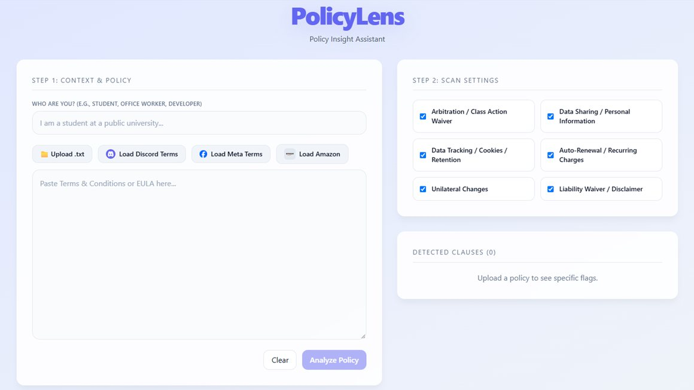

# PolicyLens

A web app that reads Terms of Service so you don't have to. Paste or upload a policy, pick what you care about, and PolicyLens flags the relevant clauses and summarizes each one in plain language with Google Gemini.

Built at **HenHacks 2026** by a 2-person team.



## Inspiration

We wanted to build something that solves a real problem and could be useful to anyone. We were partly inspired by the South Park episode "HUMANCENTiPAD", where a character blindly accepts the terms and conditions and faces serious consequences, so we made an app that helps people understand what they're agreeing to.

## What it does

- **Context-aware.** Tell it who you are ("I'm a photographer posting to Pinterest…", "I'm a student", "I run a small business") and the summaries are written for your situation.
- **Pick your concerns.** Choose broad categories (data sharing and tracking, arbitration, liability) and specific issues (auto-renewals, copyright).
- **Flags the clauses.** Keyword detection finds the relevant sections and shows them as clickable snippets that jump to the exact spot in the policy.
- **Plain-language summaries.** Each flagged section is sent to Gemini, which returns a simple, structured summary. Points that match the topics you marked as important are highlighted.
- **Quick start.** Upload a `.txt` file, paste a policy, or load the Discord, Meta, or Amazon terms with one click.
- **Chrome extension.** A small companion extension (`manifest.json`, `popup.html`, `background.js`) opens PolicyLens from the browser toolbar.

## How we built it

1. Submitted text is normalized and split into 500-character chunks.
2. Each supported category has a list of keywords; every chunk is checked against them, and matches are flagged.
3. Flagged chunks and the user's context go to a small Express backend (`POST /api/summarize`), which calls Gemini with a structured prompt. The API key stays on the server and never reaches the browser.
4. Gemini returns categorized bullet points, each with a predefined tag. The frontend highlights the bullets whose tags match the user's selections.

**Stack:** React, TypeScript, Vite, and Tailwind CSS on the frontend; Node.js and Express on the backend; Google Gemini API (`@google/generative-ai`).

## Running locally

Requires Node.js and a [Gemini API key](https://aistudio.google.com/app/apikey).

```bash
# Backend (runs on port 3001)
cd server
npm install
echo "GEMINI_API_KEY=your-key-here" > .env
node index.js

# Frontend, in a second terminal from the repo root
npm install
npm run dev
```

## Challenges we ran into

- **Adding AI mid-project.** We didn't originally plan on an AI integration, so we had to restructure part of the architecture and add a backend to keep the Gemini API key secure.
- **CSS that got out of hand.** Styling started simple, but as the project grew, even small adjustments became a hassle. We switched to Tailwind partway through, even though neither of us had much experience with it.
- **Edge cases.** Inconsistent policy formatting, truncated AI responses, and a clear button that didn't always reset everything. Every time we fixed one, two more showed up.

## Accomplishments we're proud of

We're proud of how the final UI turned out, and we added several features we didn't think we'd have time for. Some were much harder than expected, like clicking a flagged clause to jump to its exact location in the policy, but those details are what make the app feel complete.

## What we learned

How to set up and structure a Node.js backend, how to integrate an LLM securely through an API, and how to manage time and merge conflicts on a tight deadline. We also got comfortable with Tailwind CSS.

## Team

- **Ariel Goldring** ([@arigoldring](https://github.com/arigoldring)): project setup, input handling, text normalization and chunking, the rule-based clause detection, the Gemini pipeline (sending only flagged chunks, prompt and token tuning), and most of the UI: category menu, jump-to-clause, highlighted critical findings, the Tailwind migration, and the example-policy presets
- **Valerie** ([@CosmoKittikus](https://github.com/CosmoKittikus)): Chrome extension, Express backend and its Gemini connection (including keeping the API key out of the repo), the user-context field, and a visual design pass
